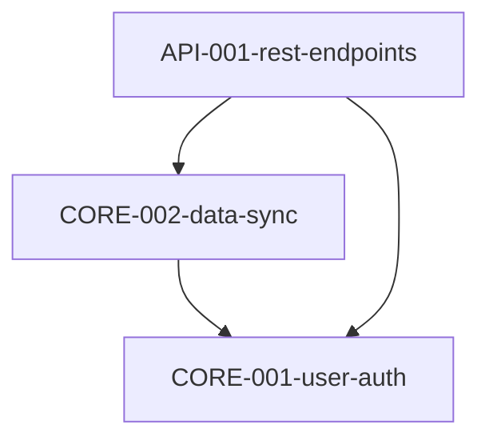

# Spectrena

**Spec-driven development with lineage tracking for AI-assisted coding.**

Spectrena extends [spec-kit](https://github.com/github/spec-kit) with
configurable spec IDs, discovery phases, parallel development via git worktrees,
and full traceability from specs → tasks → code.

## Quick Start

```bash
# Install
uv tool install spectrena[lineage-surreal]

# Initialize a project
cd my-project
spectrena init

# Check your setup
spectrena check

# In Claude Code, use slash commands
/spectrena.specify "User authentication" -c CORE
/spectrena.plan
/spectrena.tasks
/spectrena.implement
```

> **Note:** Spectrena is currently optimized for **Claude Code**. The clarifying
> questions workflow and slash commands are tuned for Claude's conversational
> capabilities. Other agents may be supported in the future.

## What It Does

| Feature                   | Description                                                      |
| ------------------------- | ---------------------------------------------------------------- |
| **Configurable Spec IDs** | `{component}-{NNN}-{slug}` patterns with per-component numbering |
| **Discovery Phase**       | Explore ideas before committing to architecture                  |
| **Parallel Development**  | Git worktrees with dependency-aware task selection               |
| **Lineage Tracking**      | Trace specs → plans → tasks → code changes                       |
| **Serena Integration**    | Automatic code change recording with symbol-level tracking       |
| **AI-Native Workflow**    | MCP tools + slash commands for Claude Code                       |

## Installation

> **Claude Code Only:** Spectrena templates are currently optimized for Claude
> Code. Other agents (Cursor, Copilot, Gemini, etc.) are not yet supported.

### From Git (recommended during development)

```bash
# Install from GitHub
uv tool install "git+https://github.com/rghsoftware/spectrena"

# With lineage tracking
uv tool install "git+https://github.com/rghsoftware/spectrena[lineage-surreal]"

# One-off execution without installing
uvx --from "git+https://github.com/rghsoftware/spectrena" spectrena --help
```

### From PyPI (when published)

```bash
# Basic install
uv tool install spectrena

# With lineage tracking (recommended)
uv tool install spectrena[lineage-surreal]
```

### With Serena Fork (full traceability)

```bash
# Install both Spectrena and the Serena fork
uv tool install "git+https://github.com/rghsoftware/spectrena[lineage-surreal]"
uv tool install "git+https://github.com/rghsoftware/serena-lineage"
```

### Verify Installation

```bash
spectrena --help
spectrena check
sw --help
```

## Project Structure

After `spectrena init`, your project will have:

```
my-project/
├── .spectrena/              # Internal state
│   ├── config.yml           # Project configuration (commit this)
│   ├── discovery.md         # Discovery phase output (commit this)
│   └── lineage/             # Lineage database (gitignore this)
├── templates/               # User-editable templates
│   ├── spec-template.md
│   ├── plan-template.md
│   └── commands/            # Slash command prompts
├── specs/                   # Spec directories
│   └── CORE-001-user-auth/
│       ├── spec.md
│       └── plan.md
├── deps.mermaid             # Dependency graph (Mermaid format)
├── AGENTS.md                # Multi-agent support documentation
├── CLAUDE.md                # Claude-specific agent context
└── .mcp.json                # MCP server config
```

## Recommended .gitignore

```gitignore
# Spectrena - lineage database (local state, not shared)
.spectrena/lineage/

# Optional: ignore discovery if you prefer not to commit exploration docs
# .spectrena/discovery.md
```

**What to commit vs ignore:**

| Path                      | Commit? | Reason                                 |
| ------------------------- | ------- | -------------------------------------- |
| `.spectrena/config.yml`   | ✅ Yes  | Project configuration, share with team |
| `.spectrena/discovery.md` | ✅ Yes  | Exploration context, useful history    |
| `.spectrena/lineage/`     | ❌ No   | Local database state                   |
| `templates/`              | ✅ Yes  | User-customized templates              |
| `specs/`                  | ✅ Yes  | The whole point!                       |
| `deps.mermaid`            | ✅ Yes  | Dependency graph                       |
| `AGENTS.md`               | ✅ Yes  | Multi-agent support documentation      |
| `CLAUDE.md`               | ✅ Yes  | Claude-specific agent context          |
| `.mcp.json`               | ✅ Yes  | MCP configuration                      |

## CLI Commands

| Command          | Description                                           |
| ---------------- | ----------------------------------------------------- |
| `spectrena init` | Initialize project with wizard, download templates    |
| `spectrena check`| Verify required tools are installed, display version  |

All other functionality is available through slash commands in your AI agent.

### Worktree Commands (`sw`)

| Command              | Description                    |
| -------------------- | ------------------------------ |
| `sw list`            | List spec branches with status |
| `sw ready`           | Show specs with deps satisfied |
| `sw create <branch>` | Create worktree for spec       |
| `sw open <branch>`   | Open in new terminal           |
| `sw merge <branch>`  | Merge and cleanup              |
| `sw status`          | Show active worktrees          |

### Dependency Commands (`sw dep`)

| Command                 | Description            |
| ----------------------- | ---------------------- |
| `sw dep add X Y`        | X depends on Y         |
| `sw dep rm X Y`         | Remove dependency      |
| `sw dep check`          | Validate graph         |
| `sw dep show`           | ASCII visualization    |
| `sw dep show --mermaid` | Raw Mermaid output     |
| `sw dep sync`           | Sync file ↔ lineage DB |

**AI-assisted:** Use `/spectrena.deps` in Claude Code for automatic analysis.

## Slash Commands (Claude Code Only)

These commands are specifically designed for Claude Code's conversational capabilities:

| Command                                | Description                               |
| -------------------------------------- | ----------------------------------------- |
| `/spectrena.discover "idea"`           | Explore project idea before architecture  |
| `/spectrena.constitution`              | Establish project principles              |
| `/spectrena.specify "Feature" -c COMP` | Create feature specification              |
| `/spectrena.clarify`                   | Ask clarifying questions about spec       |
| `/spectrena.plan`                      | Create implementation plan                |
| `/spectrena.tasks`                     | Generate actionable tasks from plan       |
| `/spectrena.implement`                 | Execute implementation for current task   |
| `/spectrena.deps`                      | Analyze and generate dependency graph     |

## Configuration

**`.spectrena/config.yml`:**

```yaml
spec_id:
  template: "{component}-{NNN}-{slug}"
  padding: 3
  components: [CORE, API, UI, INFRA]
  numbering_source: "directory" # or "database"

spectrena:
  enabled: true
  db_type: "surrealdb"
  lineage_db: "surrealkv://.spectrena/lineage"

workflow:
  require_component_flag: true
  validate_components: true
```

## Dependency Graph

Dependencies use **Mermaid format** for Claude-native generation:

**`deps.mermaid`:**



Generate automatically with `/spectrena.deps` or manually with `sw dep add`.

## MCP Integration

**`.mcp.json`:**

```json
{
  "mcpServers": {
    "spectrena": {
      "command": "spectrena-mcp"
    },
    "serena": {
      "command": "serena",
      "args": ["start-mcp-server", "--transport", "stdio"]
    }
  }
}
```

**Available MCP tools:**

| Tool                              | Description                       |
| --------------------------------- | --------------------------------- |
| `phase_get()`                     | Get current phase and active task |
| `task_start(task_id)`             | Begin working on a task           |
| `task_complete(task_id, minutes)` | Mark task done                    |
| `task_context(task_id)`           | Get full context                  |
| `ready_specs()`                   | List unblocked specs              |
| `dep_graph_analyze()`             | Get specs for dependency analysis |
| `dep_graph_save(mermaid)`         | Save dependency graph             |

## Lineage Tracking

When enabled, Spectrena tracks:

- **Specs** → status, component, weight, dependencies
- **Plans** → linked to specs
- **Tasks** → time tracking, completion status
- **Code changes** → file, symbol, task context (via Serena)

**Query examples:**

```bash
# What breaks if CORE-001 slips?
spectrena impact CORE-001

# What's ready to work on?
sw ready

# Velocity over last 7 days
spectrena velocity --days 7
```

## Workflow

### 1. Initialize Project

```bash
spectrena init
# Or with discovery recommendations:
spectrena init --from-discovery
```

### 2. Discovery (Optional - Phase -2)

In Claude Code:

```
/spectrena.discover "Task management app for ADHD users"
# Creates .spectrena/discovery.md with recommendations
```

### 3. Constitution (Optional - Phase -1)

```
/spectrena.constitution
# Establishes project principles in .spectrena/constitution.md
```

### 4. Create Specs

In Claude Code:

```
/spectrena.specify "User authentication" -c CORE
# Claude asks clarifying questions, creates spec, and switches to spec branch
```

Brief descriptions are fine - Claude will ask 2-3 clarifying questions if needed.

### 5. Plan & Implement

```
/spectrena.plan       # Create implementation plan
/spectrena.tasks      # Break into actionable tasks
/spectrena.implement  # Execute tasks one by one
```

### 6. Parallel Development (Advanced)

```bash
# Set up dependencies
/spectrena.deps  # In Claude Code

# Work on unblocked specs using worktrees
sw ready
sw create spec/CORE-001-user-auth
# ... implement ...
sw merge spec/CORE-001-user-auth
```

## Supported Agents

| Agent       | Status       | Notes                                                                                            |
| ----------- | ------------ | ------------------------------------------------------------------------------------------------ |
| Claude Code | ✅ Supported | Full support, optimized templates                                                                |
| Others      | ⚠️ Untested  | [spec-kit](https://github.com/github/spec-kit) templates may work with little to no modification |

Spectrena's templates are optimized for Claude Code's conversational
capabilities. For other agents (Cursor, Copilot, Gemini, Windsurf, etc.), the
original [spec-kit templates](https://github.com/github/spec-kit/releases) may
be compatible but are untested with Spectrena's workflow.

Want to help test other agents? [Open an issue](https://github.com/rghsoftware/spectrena/issues)
with your findings.

## Development

```bash
# Clone
git clone https://github.com/rghsoftware/spectrena
cd spectrena

# Install editable
uv tool install -e ".[lineage-surreal]"

# Run tests
uv pip install -e ".[dev]"
pytest
```

## Architecture

```
┌─────────────────────────────────────────────────────────────────┐
│                         SPECTRENA                               │
├─────────────────────────────────────────────────────────────────┤
│  CLI Layer (pure Python)                                        │
│  ┌──────────┐  ┌──────────┐  ┌──────────┐                      │
│  │   init   │  │   check  │  │  sw dep  │                      │
│  └──────────┘  └──────────┘  └──────────┘                      │
│                                                                 │
│  Slash Commands (AI Agent)                                      │
│  ┌──────────┐  ┌──────────┐  ┌──────────┐  ┌──────────┐        │
│  │ discover │  │ specify  │  │   plan   │  │implement │        │
│  └──────────┘  └──────────┘  └──────────┘  └──────────┘        │
│                                                                 │
│  MCP Servers (Optional)                                         │
│  ┌────────────────────────┐    ┌────────────────────────┐      │
│  │    spectrena-mcp       │    │    serena-mcp          │      │
│  │  (lineage tracking)    │    │  (semantic editing)    │      │
│  └───────────┬────────────┘    └───────────┬────────────┘      │
│              └──────────┬──────────────────┘                    │
│                         ▼                                       │
│  Data Layer  ┌─────────────────────────────────────────────┐   │
│              │ .spectrena/lineage (SurrealDB)               │   │
│              └─────────────────────────────────────────────┘   │
└─────────────────────────────────────────────────────────────────┘
```

## License

MIT

## Credits

- Based on [spec-kit](https://github.com/github/spec-kit) by GitHub
- Semantic editing via [Serena](https://github.com/oraios/serena) fork
