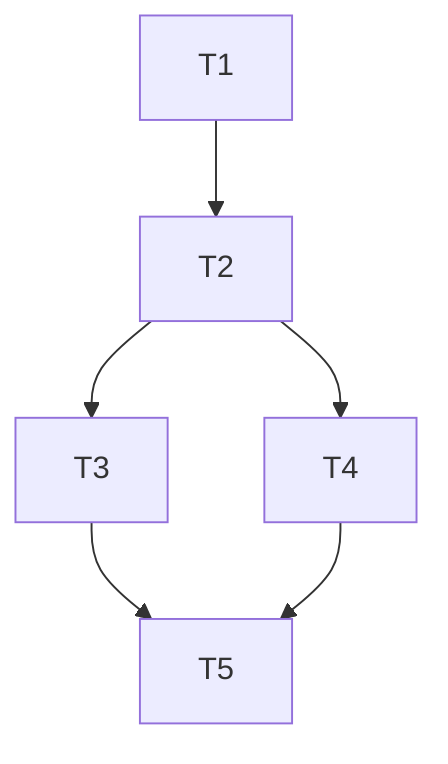

# /spectrena.tasks

Extract actionable tasks from the implementation plan.

## Usage

```
/spectrena.tasks
```

## Behavior

1. **Find current spec directory**

2. **Read plan.md** - must exist (run `/spectrena.plan` first if not)

3. **Extract tasks** organized by phase/component

4. **Create tasks.md** with:
   - Task IDs
   - Dependencies between tasks
   - Estimated complexity
   - File paths where work will happen

## Output Format

Create `tasks.md` in the spec directory:

```markdown
# Tasks: {SPEC_ID}

## Phase 1: [Phase Name]

### T1: [Task Title]
- **Complexity:** S/M/L
- **Files:** `src/path/to/file.py`
- **Depends on:** (none)
- **Description:** Brief description of what to implement

### T2: [Task Title]
- **Complexity:** M
- **Files:** `src/auth/oauth.py`, `src/auth/providers/`
- **Depends on:** T1
- **Description:** ...

## Phase 2: [Phase Name]

### T3: [Task Title]
...

## Task Dependency Graph



## Summary

| Phase | Tasks | Total Complexity |
|-------|-------|------------------|
| Phase 1 | 3 | M |
| Phase 2 | 4 | L |
| **Total** | **7** | |
```

## Example

```
User: /spectrena.tasks

Claude: Reading specs/CORE-001-oauth-authentication/plan.md...

Extracting tasks...

✓ Created: specs/CORE-001-oauth-authentication/tasks.md

Found 7 tasks across 2 phases:
- Phase 1 (Setup): 3 tasks
- Phase 2 (Implementation): 4 tasks

Task dependency graph included. Ready to implement!
```

## Notes

- **Requires plan.md** - run `/spectrena.plan` first
- **Task IDs are local** - T1, T2, etc. within this spec
- **Dependencies tracked** - both within spec and to other specs
